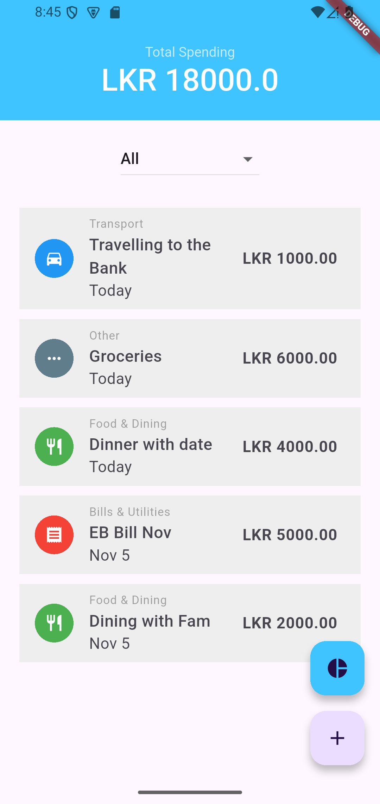
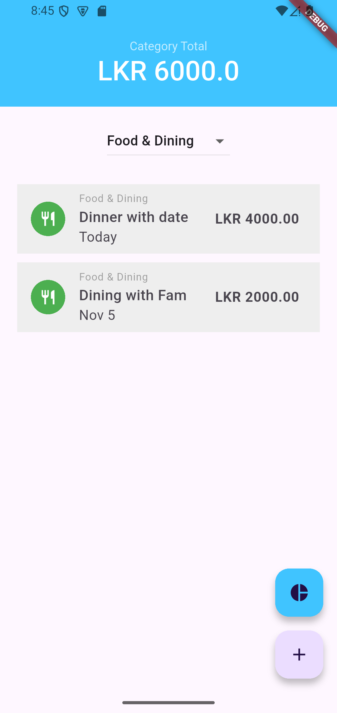
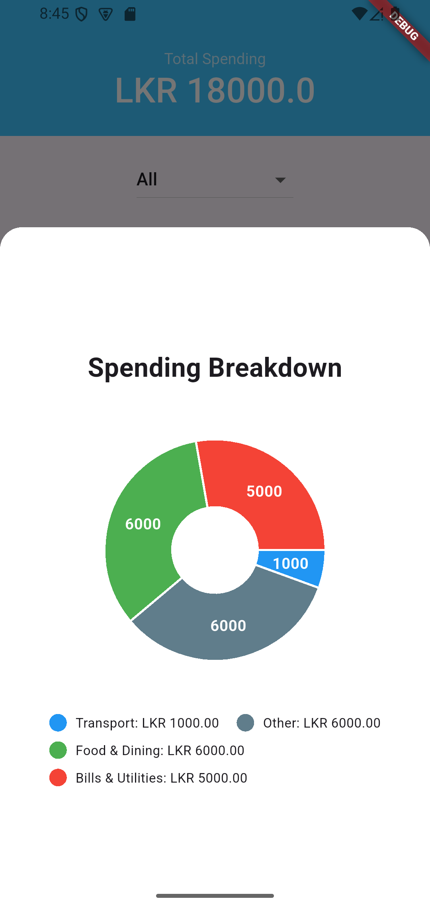
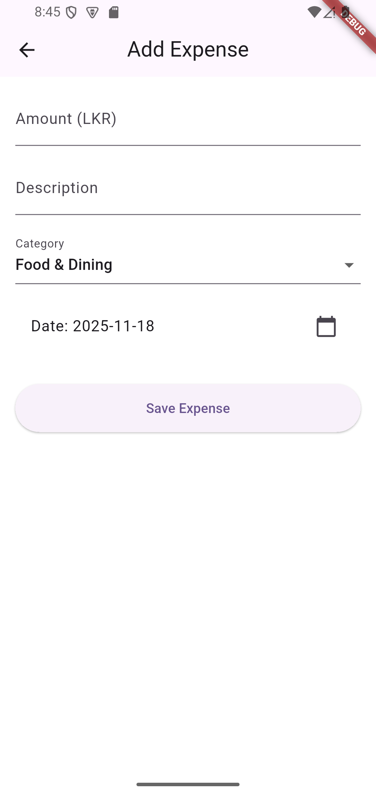

# Personal Finance Tracker 💰

A beautiful Flutter mobile application for tracking personal expenses with category-based organization and visual spending breakdown.


## 📱 Screenshots

<div style="display: flex; flex-wrap: wrap; gap: 10px;">
  
  
  
  
</div>

## ✨ Features

### Core Functionality
- ✅ **Add Expenses** - Quick expense entry with amount, description, category, and date
- ✅ **Delete Expenses** - Swipe-to-delete with confirmation dialog
- ✅ **Category Filtering** - Filter expenses by 8 predefined categories
- ✅ **Real-time Totals** - Automatic calculation of total spending
- ✅ **Persistent Storage** - SQLite database for offline data storage

### Data Visualization
- 📊 **Interactive Pie Chart** - Visual breakdown of spending by category
- 🎨 **Color-coded Categories** - Each category has unique color and icon
- 📋 **Legend Display** - Clear labels showing amounts per category
- 📱 **Modal Bottom Sheet** - Smooth chart presentation

### Smart UI/UX
- 📅 **Dynamic Date Formatting** - "Today", "Yesterday", or specific dates
- 🎯 **Empty State Handling** - Helpful messages when no data exists
- 🎨 **Material Design** - Clean, modern interface
- 🔄 **Smooth Animations** - Professional transitions and interactions

## 🎨 Categories

The app includes 8 predefined expense categories:

| Category | Icon | Use Case |
|----------|------|----------|
| 🍽️ Food & Dining | restaurant | Meals, groceries, dining out |
| 🚗 Transport | directions_car | Fuel, public transport, taxi |
| 🛒 Shopping | shopping_cart | Retail purchases, online shopping |
| 📄 Bills & Utilities | receipt | Electricity, water, internet |
| 🎬 Entertainment | movie | Movies, games, subscriptions |
| 💪 Health & Fitness | fitness_center | Gym, medicine, healthcare |
| 📚 Education | school | Books, courses, tuition |
| ⋯ Other | more_horiz | Miscellaneous expenses |

## 🛠️ Technologies Used

- **Framework:** Flutter 3.x
- **Language:** Dart
- **Database:** SQLite (sqflite ^2.3.0)
- **Charts:** fl_chart ^0.68.0
- **Date Formatting:** intl package
- **Architecture:** Model-View pattern with StatefulWidgets

## 📁 Project Structure
```
lib/
├── models/
│   ├── category.dart       # Category data model
│   └── expense.dart        # Expense data model
├── screens/
│   ├── home_screen.dart    # Main expense list screen
│   └── add_expense_screen.dart  # Expense entry form
├── widgets/
│   └── spending_chart.dart # Pie chart component
├── services/
│   └── database_helper.dart # SQLite operations
└── utils/
    └── date_formatter.dart  # Date formatting utilities
```

## 🎓 What I Learned

### Technical Skills
- Building complete CRUD operations in Flutter
- Working with SQLite database in mobile apps
- Implementing swipe gestures and confirmations
- Creating interactive data visualizations
- Managing state across multiple screens
- Data transformation and aggregation (Map operations)

### Key Concepts
- **Map Operations:** Using `.map()` for data transformation
- **Database Design:** Proper foreign key relationships
- **Widget Lifecycle:** Understanding initState and setState
- **Null Safety:** Handling nullable values properly
- **Modal Patterns:** Bottom sheets and overlays
- **List Operations:** Filtering and sorting data efficiently

### Problem-Solving
1. **Dynamic Icons Challenge**
   - Problem: Needed to convert string icon names to IconData
   - Solution: Created constant Map for icon name lookup
   
2. **Category Filtering**
   - Problem: Efficiently filter and recalculate totals
   - Solution: Implemented database queries with state management
   
3. **Chart Data Structure**
   - Problem: Transform expense data for chart consumption
   - Solution: Used Map aggregation and `.entries.map()` transformation
   
4. **ID vs Index Bug**
   - Problem: Confused database IDs with list indices
   - Solution: Always use `.firstWhere()` to find by ID, never direct indexing

## 🚀 Setup & Installation

### Prerequisites
- Flutter SDK (3.0 or higher)
- Android Studio / VS Code
- Android Emulator or physical device

### Installation Steps

1. **Clone the repository**
```bash
git clone https://github.com/ATM-Codes/personal_finance_tracker.git
cd personal_finance_tracker
```

2. **Install dependencies**
```bash
flutter pub get
```

3. **Run the app**
```bash
flutter run
```

4. **Build APK (optional)**
```bash
flutter build apk --release
```

## 🔮 Future Improvements

- [ ] **Date Range Filtering** - Filter by week, month, year
- [ ] **Budget Setting** - Set category budgets with alerts
- [ ] **Recurring Expenses** - Auto-add monthly bills
- [ ] **Export Data** - CSV/PDF export functionality
- [ ] **Multiple Chart Types** - Bar charts, line graphs
- [ ] **Dark Mode** - Theme switching support
- [ ] **Cloud Sync** - Firebase integration
- [ ] **Search Function** - Find expenses by description
- [ ] **Expense Editing** - Modify existing entries
- [ ] **Statistics Dashboard** - Detailed spending analytics

## 📊 Development Stats

- **Development Time:** 3 days (Nov 16-19, 2025)
- **Total Coding Hours:** ~12 hours
- **Lines of Code:** ~800
- **Commits:** 15+
- **Features Implemented:** 10

## 🎯 Project Goals

This project was built as part of my journey to become a Flutter/React Native developer, with the goal of securing a mobile development position by February 2026. 

**Key Objectives:**
- Master Flutter fundamentals
- Build production-ready apps
- Learn clean code practices
- Create portfolio-worthy projects
- Develop problem-solving skills

## 📝 Lessons Learned

1. **Always validate data before UI operations** - Check for empty lists, null values
2. **IDs ≠ Indices** - Never use database IDs as array positions
3. **State management is crucial** - Proper setState usage prevents bugs
4. **Testing saves time** - Test each feature thoroughly before moving on
5. **Documentation matters** - Good comments and README help future you

## 🤝 Contributing

This is a personal learning project, but feedback and suggestions are welcome!

## 📄 License

This project is open source and available under the MIT License.

## 👨‍💻 Developer

**Your Name**
- Location: Negombo, Sri Lanka
- Target: Flutter/React Native Developer position by Feb 2026
- GitHub: [@ATM-Codes](https://github.com/ATM-Codes)

---

**Built with ❤️ using Flutter**

*Learning, building, and growing one commit at a time!* 🚀
